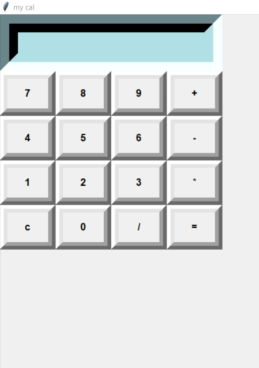

# -Calculator-in-python
using python tkintar
# Calculator in Python

This is a simple GUI calculator made using **Python Tkinter**.  
It supports addition, subtraction, multiplication, and division.

## How to Run
1. Make sure Python is installed.
2. Run the file:
## 📸 Screenshot

